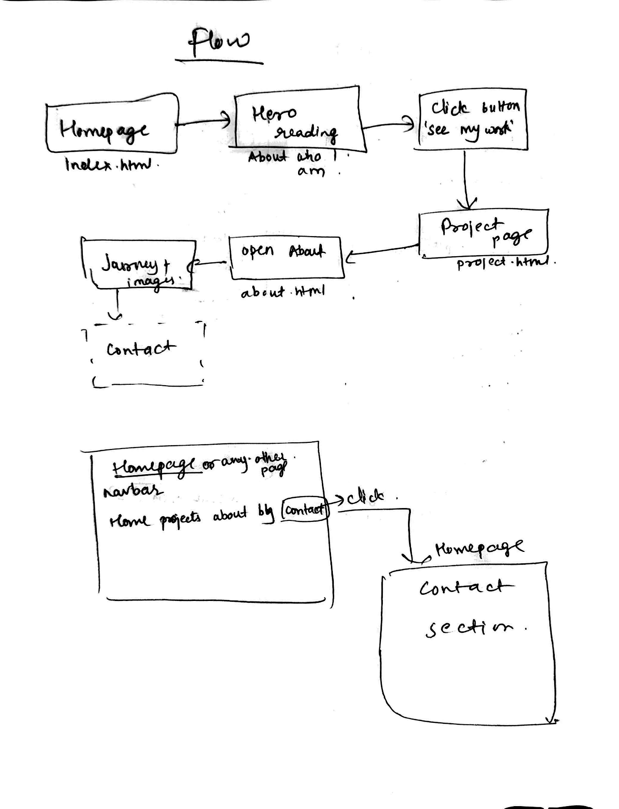
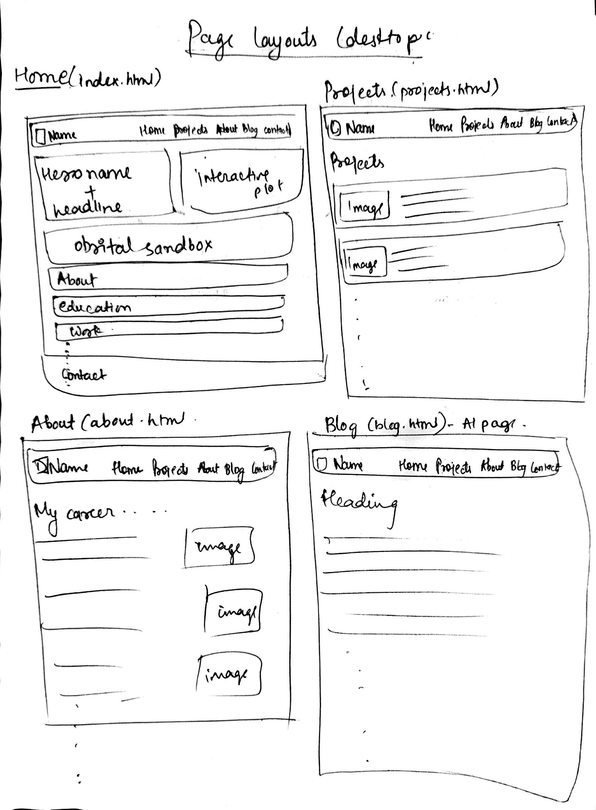
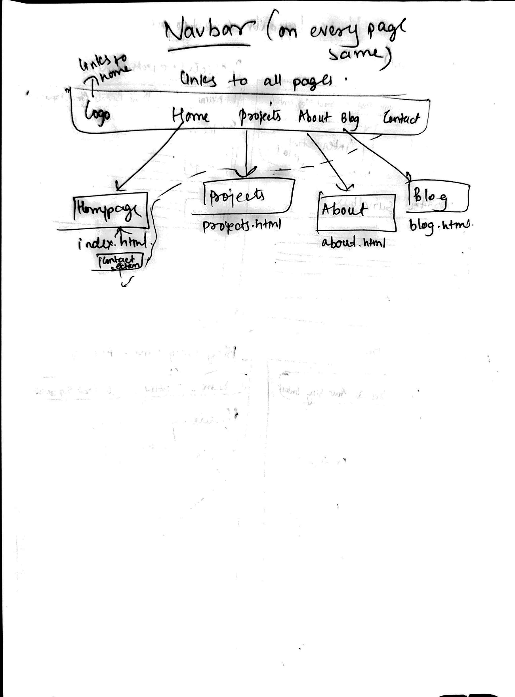
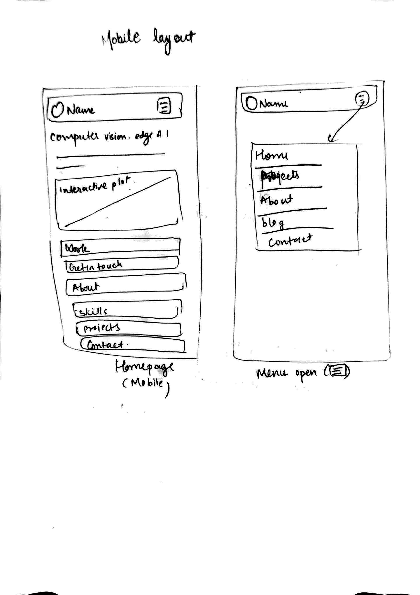

# Trupal Jageshkumar Patel's Personal Homepage

**Design Document**

## 1. Project description

A static, front-end-only personal homepage for a computer-vision & machine-learning
engineer. Its job is to introduce the person, show credible proof of work, and
make it effortless to get in touch — while demonstrating clean, standards-based
HTML, CSS, and vanilla ES6.

The visual concept is a **plotter's notebook**: warm graph-paper, heavy
grotesque poster type, and a navy + magenta + cobalt palette. The hero is a
**live regression playground** — click to drop data points and a least-squares
line refits in real time. It is a literal nod to the subject matter (fitting a
model to noisy data) and gives the page a memorable identity without stock
imagery.

**Scope:** four pages (Home, Projects, About, Blog), no backend, no framework,
no component library. Home, Projects, and About are written by the author; the
Blog article is the AI-generated page. Deployed as a public static site.

**Non-goals:** blog CMS, contact form backend, authentication, analytics.

---

## 2. User personas

### Persona A — Mansi, the recruiter

- **Age / role:** 25, technical recruiter at a mid-size company.
- **Context:** skims dozens of portfolios a day, often on a laptop between calls.
- **Goals:** quickly judge whether this person's skills fit an open ML role, and
  find a way to contact them.
- **Frustrations:** portfolios that bury the person's actual skills under visual
  noise, or hide the contact details.
- **Needs from the page:** a one-line summary of who this is, a scannable list of
  focus areas, and an obvious contact action.

### Persona B — Margi, the hiring engineer

- **Age / role:** 28, senior ML engineer who will interview the candidate.
- **Context:** wants substance — did this person actually ship anything?
- **Goals:** read a couple of project write-ups and check that the work is real.
- **Frustrations:** vague project cards with no outcome or decision explained.
- **Needs from the page:** project pages with the problem, the approach, and the
  result stated plainly; links to code.

### Persona C — Janvi, a fellow student / peer

- **Age / role:** 23, classmate exploring how others built their homepage.
- **Context:** curious about the tech and the "creative addition."
- **Goals:** see the interactive component and understand the build.
- **Frustrations:** sites that are impressive but impossible to learn from.
- **Needs from the page:** a working, delightful demo and a clear README/repo.

---

## 3. User stories

These are the use cases, written as short stories.

### Story 1: First Impression
A recruiter finds my resume link and clicks through. She lands on my homepage
and, within a few seconds, sees my name and that I'm a CS grad student at
Northeastern building computer-vision and machine-learning systems; nothing else
is competing for her attention. If she wants more, the nav bar is right there,
and my email is one click to copy.

### Story 2: Going Deeper
A hiring engineer wants to know whether my research and projects are real, so he
opens the Projects page. Instead of a wall of text for every project, he sees one
line summarising each, and only expands the ones he's curious about — the Jetson
Nano detection work published at ICT4SD, the IoT waste-bin monitor, or the
satellite image processing I did at ISRO — each linking to its paper. The longer
write-ups live on their own page, so Home stays short for people who don't want
them.

### Story 3: Trying It Out
A fellow student is curious about the creative part of the site. On Home he
clicks the regression plot to drop points and watches the best-fit line update
live, then drags a satellite into orbit in the little gravity sandbox. Because
he's a keyboard person, he presses ⌘K and moves around the site without
touching the mouse — and a small hint tells him the shortcut is there, so he
isn't expected to guess it.

### Story 4: Reaching Out
Someone lands on the site just wanting my email and GitHub, and finds them
without hunting — a copy-email button and clear links. Because it's a static
site, the half-minute they give it is spent reading, not watching a spinner.

### Story 5: For Everyone
A screen-reader user can use the whole site, because every image is described and
every control is a real button or link. Someone who prefers a darker screen or
less motion gets a dark theme and reduced-motion support that the site remembers.

---

## 4. Design tokens

- **Palette (light, default):** `--paper #f6f4ee` (warm graph paper),
  `--ink #17203a` (near-black navy), `--hot #ff2e7e` (magenta, data points &
  highlights), `--cool #1f5bd6` (cobalt, the fitted line & links).
- **Palette (dark):** `--paper #0f1320`, `--ink #f1f3f8`, `--hot #ff5b98`,
  `--cool #79a6ff`.
- **Type:** Bricolage Grotesque (characterful display), Hanken Grotesk (highly
  legible body), Space Mono (data labels, equations, nav — only where it is
  genuinely data).
- **Accent strategy:** two accents with distinct jobs — magenta = data,
  cobalt = the model. Deliberately avoids the cream-and-terracotta and
  single-acid-accent-on-black defaults.
- **Signature devices:** a graph-paper background grid, hard 1.5px ink borders,
  and offset drop-shadows (a plotted, printed feel rather than soft SaaS cards).

## 5. Design mockups (wireframes)

I sketched each page by hand to work out the layout — what goes where, how the
navigation connects the pages, and roughly what I'll place in each section. These
are my original hand-drawn wireframes.

### User flow

### Page layouts (desktop)

### Site map — page connections

### Mobile layout

---

## 6. Design rationale (self-critique)

- **One bold element, quiet everywhere else:** the regression playground is the
  single memorable moment; every other section is calm, bordered, and consistent
  so the hero stands out.
- **Structure encodes meaning:** section labels are written as function calls
  (`about()`, `focus()`, `projects()`) — an on-theme affordance for a data page,
  not generic `01 / 02 / 03` numbering, since the sections are not a sequence.
- **Motion is purposeful:** there is no ambient animation at all; the only motion
  is the plot responding to your clicks (and button hovers). This avoids the
  scattered scroll-reveal effects that read as generated, and it means
  `prefers-reduced-motion` users lose nothing.
- **Chanel's rule:** cut anything that only decorates. The graph paper, borders,
  and offset shadows each signal "plotted/printed"; the palette stays to three
  inks plus paper.
