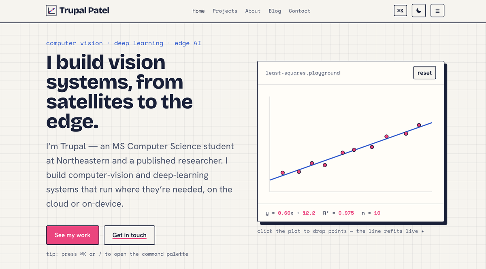
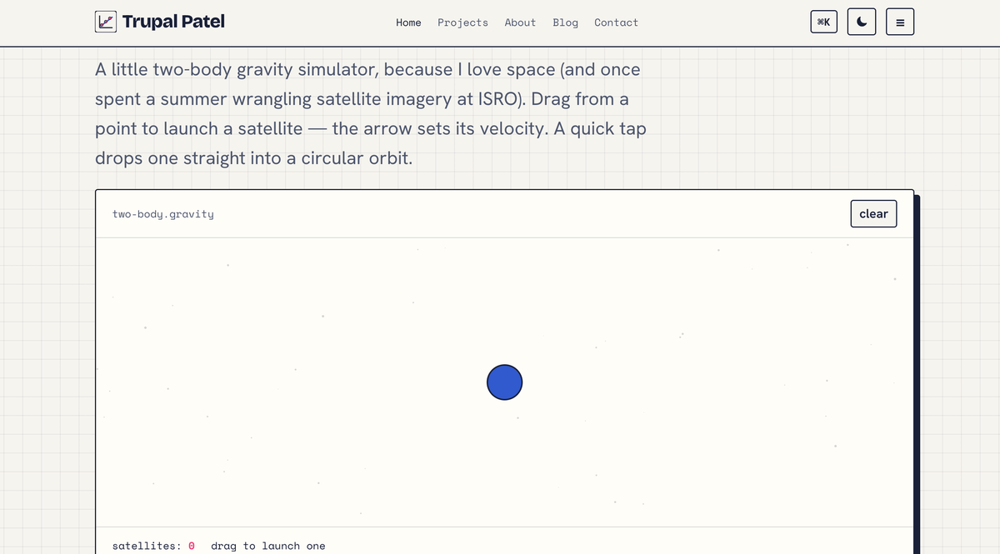
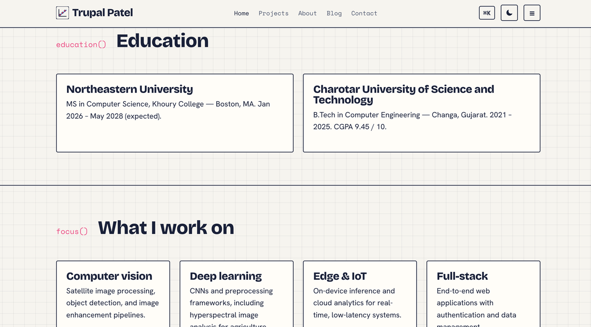

# Trupal Jageshkumar Patel — Personal Home Page

## Author

Trupal Jageshkumar Patel

## Project Description

This project is a personal portfolio website for Trupal Jageshkumar Patel. The
site presents my background, education, skills, projects, and research in a
clean, multi-page, static front-end format. It is styled as an editorial
"plotter's notebook" and doubles as a live portfolio for my co-op and internship
search in computer vision and machine learning.

## Project Objective

The goal of this assignment was to build a personal homepage using vanilla
HTML5, CSS3, and ES6+ — no backend and no component libraries — that introduces
who I am, shows my education, experience, and work, and gives visitors a way to
reach me, while meeting the course's technical requirements: semantic structure,
responsive layout, organised CSS without `!important`, linting and formatting,
original JavaScript features, and a public deployment.

## Course

CS5610 Web Development — Northeastern University
Instructor: John Alexis Guerra Gomez
Course link: https://johnguerra.co/classes/webDevelopment_online_fall_2026/
Canvas: https://northeastern.instructure.com/courses/261032

## Submission URLs

- Deployed URL (GitHub Pages): https://tpatel2103.github.io/Trupal-homepage/
- Repository: https://github.com/Tpatel2103/Trupal-homepage
- Presentation (Google Slides): _to be added_
- Video Demonstration: _to be added_
- Design Document: [View Design Document](./docs/Trupal_Patel_Design_Document.pdf)

## Screenshots

**Home — hero with the interactive regression plot**



**Home — orbital sandbox**



**Home — Education & Focus sections**



## Technologies Used

- HTML5
- CSS3 (Grid & Flexbox — no Bootstrap or other component libraries)
- Vanilla JavaScript (ES6 modules)
- Canvas API (for the interactive visuals)
- Google Fonts (Bricolage Grotesque, Hanken Grotesk, Space Mono)
- ESLint (class configuration)
- Prettier
- Git & GitHub
- GitHub Pages

## Pages Included

**Home (index.html)**
A full hero with my name, a monospace kicker, and the headline "I build vision
systems, from satellites to the edge," alongside an interactive least-squares
regression playground. Below it are the orbital sandbox and the About, Education,
Skills, Courses, Projects, Research, Hobbies, and Contact sections.

**Projects (projects.html)**
An editorial list of the systems I have built end to end — real-time object
detection on Jetson Nano, IoT waste-bin monitoring, satellite image processing at
ISRO, hyperspectral leaf-pathogen detection, and a full-stack blood-bank
application — each with a cover, a short write-up, tags, and links to
publications where relevant.

**About (about.html)**
My career journey in first person, from Computer Engineering at CHARUSAT and
research in computer vision and IoT, to my internship at ISRO's Space
Applications Centre and my MS in Computer Science at Northeastern, with images
from each stage.

**Blog (blog.html)**
A short article, "Getting computer vision onto the edge." This is the
AI-generated page required by the assignment.

## Creative Addition

The site includes three original interactive features, all written in vanilla
ES6 with no libraries:

- **Regression playground** (hero) — click the plot to add data points and a
  least-squares line refits in real time, with a live equation and R².
- **Orbital sandbox** — a two-body gravity simulator; drag to launch a satellite
  and watch it orbit, escape, or fall back. My nod to space and my
  satellite-imaging work at ISRO.
- **Command palette** — press ⌘K (or Ctrl-K) on any page to navigate and run
  actions from the keyboard.

## Instructions to Build & Run

### Prerequisites

- Node.js
- npm
- A modern web browser

This is a static front-end website. Node.js and npm are only used for the dev
tools (ESLint and Prettier). Because it uses ES6 modules, it must be served over
HTTP rather than opened via `file://`.

### 1. Clone the repository

```bash
git clone https://github.com/Tpatel2103/Trupal-homepage.git
cd Trupal-homepage
```

### 2. Install dependencies

```bash
npm install
```

Installs the dev dependencies listed in `package.json` (ESLint, Prettier, and a
static server).

### 3. Run the website locally

```bash
npm start
```

Serves the site at http://localhost:3000. Any static server works — for example
the VS Code Live Server extension, or `python3 -m http.server`.

### 4. Lint and format

```bash
npm run lint
npm run format
```

### 5. View the deployed website

https://tpatel2103.github.io/Trupal-homepage/

## Image and Resource Attribution

- Site logo / favicon (`favicon.svg`) and portrait placeholder (`avatar.svg`):
  original graphics created for this project.
- Project cover illustrations (`project-*.svg`): original graphics created for
  this project.
- Project images on the About page (object-detection result, waste-bin sensor,
  and the ISRO Space Applications Centre photo): from my own projects and
  experience.
- NVIDIA and Northeastern / Khoury College marks: official third-party and
  institutional logos, used as small badge icons.
- AI-themed illustrations (`machine-learning.png`, `ai-chip.png`,
  `ai-robot-hand.png`): generic stock illustrations, used decoratively.

## Generative AI Usage

**ChatGPT (OpenAI) — GPT-5.6 Luna (Instant mode)**

Used for HTML, CSS, and JavaScript syntax and web-development concepts, and to
create the Blog page entirely.

> "What is the correct syntax to split my vanilla JavaScript into ES6 modules and
> load them with `type=\"module\"`, and how do `import`/`export` work?"

> "Write a short blog article for a computer-vision portfolio titled 'Getting
> computer vision onto the edge', covering why edge deployment is hard,
> quantisation and pruning, and why latency and model size matter."

**Claude (Anthropic) — Opus-class (2026), via the Claude web app**

Used for syntax help and to explain web-development concepts.

> "How do CSS Grid and Flexbox differ, and when should I use each?"

> "How do I draw and animate on an HTML canvas with `requestAnimationFrame`, and
> keep it accessible and W3C-valid?"

### Learning

The AI tools were also used conversationally to explain specific web-dev concepts
as they came up — for example, what `package.json`, ESLint, and Prettier configs
actually do, CSS Grid vs. Flexbox, and why ES6 modules fail over `file://`.

All AI-assisted output was reviewed and tested by me before it went into the
project. The Blog page is the one page whose content is AI-generated, and it is
labelled as such.

## Repository Files

- `index.html` — Home page
- `projects.html` — Projects page
- `about.html` — About page (my career journey)
- `blog.html` — Blog page (AI-generated)
- `css/styles.css` — styling for the entire site
- `js/main.js` — entry module that wires up the page
- `js/regression.js` — interactive least-squares regression plot
- `js/orbit.js` — two-body orbital gravity sandbox
- `js/palette.js` — ⌘K command palette
- `js/theme.js` — light/dark theme toggle
- `js/nav.js` — mobile navigation
- `js/contact.js` — copy-email button
- `images/` — image and SVG assets
- `docs/` — design document, presentation, and video script
- `package.json`, `eslint.config.js`, `.prettierrc` — tooling and configuration

## License

This project is licensed under the MIT License. See [LICENSE](./LICENSE).
